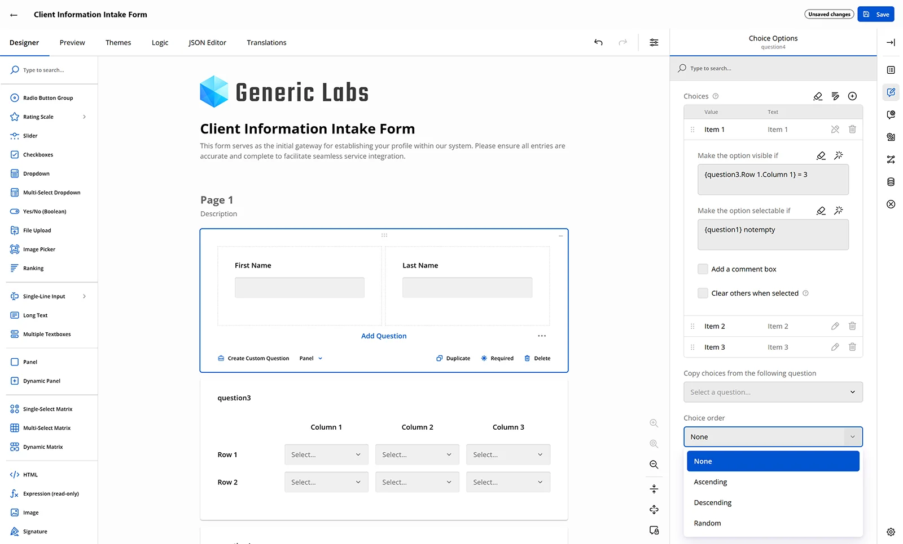
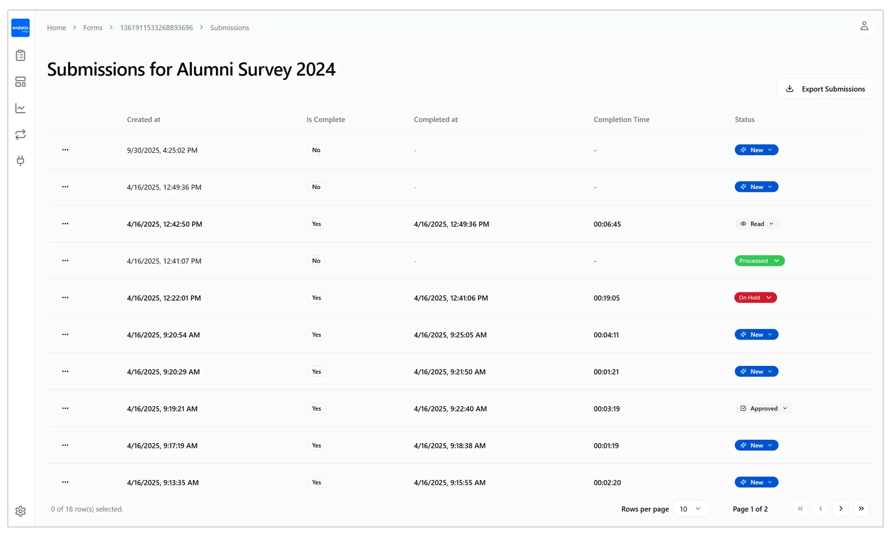
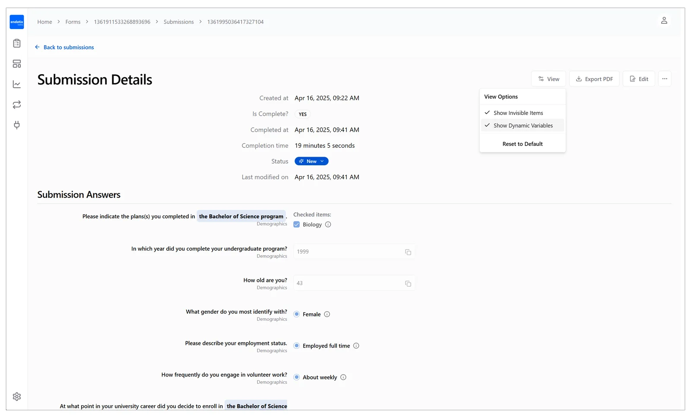

# Endatix Hub

# What is Endatix Hub
Endatix Hub is a commercial multi-tenant form management system, built on top of the [Endatix API](https://github.com/endatix/endatix) and designed for the [SurveyJS](https://github.com/surveyjs) library. It can be used to launch, build, or integrate self-hosted or SaaS solutions that focus on collecting information from [humans](https://en.wikipedia.org/wiki/Human) in industries such as market research, legal, insurance, finance, education, healthcare, and more.

This project contains user-facing interface and seamlessly integrates with the [SurveyJS Creator](https://github.com/surveyjs/survey-creator) form building tool.

## Licensing

Endatix Hub is a commercial product and it requires the purchase of a license from Endatix, Ltd. For pricing and licensing conditions please refer to our [website](https://endatix.com/) or email us at info@endatix.com.

## Features

* **Form Versioning** (Allows a form to be modified after it has started collecting submissions)
* **Form Access Control** (Forms can be publically accessible or password-protected) 
* **Form Lifecycle Management** (draft vs. published state)
* **Form Templates**
* **Themes** (Based on SurveyJS [Themes and Styles](https://surveyjs.io/form-library/documentation/manage-default-themes-and-styles))
* **Partial Submissions** (Users can resume incomplete submissions)
* **Prefilled forms**
* **Embedded or standalone forms**
* **Submission metadata** (Including completion status, date/time started, and date/time completed)
* **PDF export** (Server-side rendering with inline images)
* **Data export** (CSV, JSON, Codebook, or custom export options)
* **AI Assistant** (Chat-based AI form builder, system prompt management and analytics per tenant)
* **Webhooks** (Support for *submission completed*, *form created*, *form updated*, and *form deleted* events)
* **reCAPTCHA support**
* **Email Notifications** (Sendgrid and Mailgun connectors)
* **Database-stored Custom Question Types** (SurveyJS [specialized](https://surveyjs.io/form-library/documentation/customize-question-types/create-specialized-question-types) or [composite](https://surveyjs.io/form-library/documentation/customize-question-types/create-composite-question-types) custom question code can be added at runtime)
* **Multitenancy** (ORM-enforced tenant isolation)
* **Basic Authentication**
* **Role Based Access Control**
* **Single-Sign-On** (Supports Keycloak and other [OAuth 2.0](https://oauth.net/2/) implementations)

## Screenshots

**Form builder**<br>
<br>
**Submissions**<br>
<br>
**Submission Details**<br>
<br>

## Tech Stack

- **Framework**: [Next.js](https://nextjs.org/)
- **Backend API**: [Endatix API](https://github.com/endatix/endatix)
- **Form builder**: [SurveyJS Creator](https://github.com/surveyjs/survey-creator)
- **Database**: [Postgres](https://www.postgresql.org/), [Azure SQL](https://azure.microsoft.com/en-us/products/azure-sql/database), or [MS SQL Server](https://www.microsoft.com/en-us/sql-server)

## System Requirements

- **Node.js 20.x.x** (Node 20.9.0 is recommended)

## Supported Environments

<br>

Endatix runs on any server or workstation that supports [.NET 10.0 (formerly .NET Core)](https://dotnet.microsoft.com/en-us/download/dotnet/10.0), including **Linux**, **Windows**, and **macOS**.

It can be deployed to on-premise servers, cloud environments such as **Azure**, **AWS**, or **Google Cloud**, and also runs in [**Docker Containers**](https://hub.docker.com/u/endatix) for simplified setup and scaling.

## Prerequisites

- **pnpm >=9.0.0** - we recommend using pnpm as the package manager for this project. You can install pnpm by running `npm install -g pnpm`
- **nvm** - we recommend using nvm to manage node versions as this will help you install the correct version of node without having to manually change the node version in your system. Download nvm [here](https://github.com/nvm-sh/nvm)

>[!TIP]
>If you are using nvm, you can install the correct version of node by running `nvm install v20.9.0`

## Getting Started

1. Setup correct node version. Open the terminal and run `nvm use v20.9.0`
2. Install the dependencies. Run `pnpm install`
3. Run the development server with `pnpm dev`
4. Open [http://localhost:3000](http://localhost:3000) with your browser to see the result. 

>[!TIP]
>You can also run the website with self-signed SSL enabled by running `pnpm dev-https`, which will make the website available at [https://localhost:3000](https://localhost:3000).
>More info at [Next.js documentation](https://vercel.com/guides/access-nextjs-localhost-https-certificate-self-signed).
>💡 Remember to update your `.env` file with the correct values for the development server such as AUTH_URL, etc.

## Project Structure

For information on project structure, feature organization, and vertical slice architecture patterns, see:

- **[Project Structure](./project-structure.md)** - Quick reference for organizing features and use cases
- **[Vertical Slice Architecture](./docs/vertical-slice-architecture.md)** - Detailed architecture explanation

## Environment Variables

Check the [.env.example](./.env.example) file for all variables and their description. The required variables are marked with a `[REQUIRED]` tag.

## Running the production build locally

This is useful for testing the production build locally e.g. test with enabled caching, telemetry, etc. Note that the root `.env` file will be used to prepare the build and next.js will copy it's contents into the `hub/.next/standalone/.env` file.

1. Run `pnpm run:standalone`;
2. Run the site at [http://localhost:3000](http://localhost:3000)

## E2E Testing

The end-to-eng test suite (e2e) is built with [Playwright](https://playwright.dev/docs/intro). 

> [!TIP]
> You can use [Playwright's MCP](https://github.com/microsoft/playwright-mcp) to accelerate the workflow of intiial prototyping, debugging and running the e2e tests. Playwright's team is actively adding new features and improving the experience, so for best results we recommend using the latest version of MCP.

Check most common commands below (note you can also use `npx` instead of `pnpm exec`):

```bash
pnpm exec playwright test
```

To run the tests in interactive mode, use the following command:

```bash
pnpm exec playwright test --ui
```

To run the tests in debug mode, use the following command:

```bash
pnpm exec playwright test --debug
```

For CI or running againt a specific environment we can set the `BASE_URL` environment variable.
```sh
export BASE_URL=https://your-ci-url.com
npx playwright test
# or
BASE_URL=https://ci.app.endatix.com  npx playwright test
```


## Learn More

To learn more about Endatix, take a look at the following resources:

- [Endatix Documentation](https://docs.endatix.com/docs/category/getting-started) - learn about Endatix features and API.
