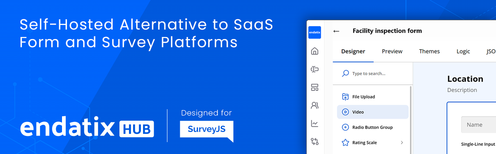
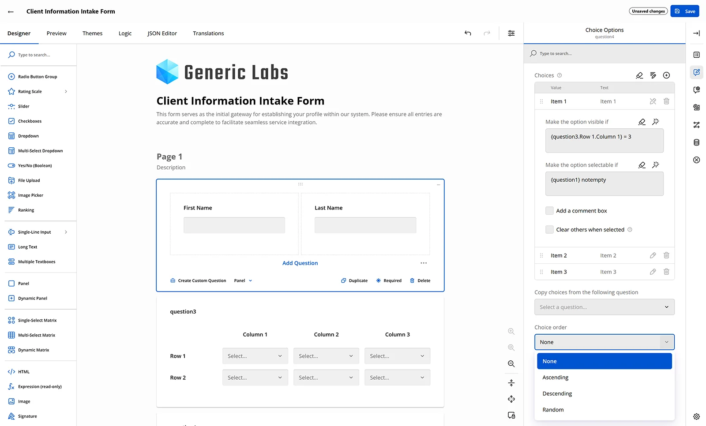
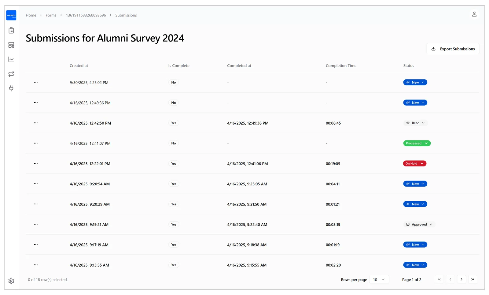
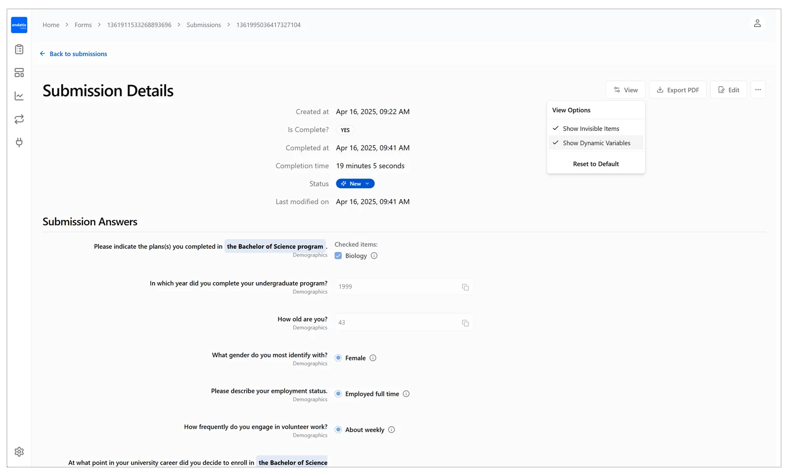
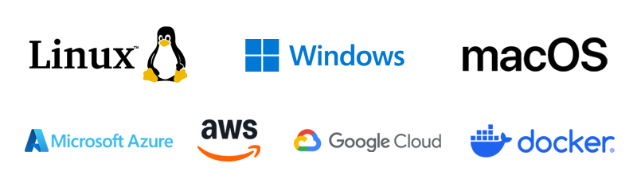

 
 

# Endatix Hub

## What is Endatix Hub
Endatix Hub is a commercial multi-tenant form management system, built on top of the [Endatix API](https://github.com/endatix/endatix) and designed for the [SurveyJS](https://github.com/surveyjs) library. It can be used to launch, build, or integrate self-hosted or SaaS solutions that focus on collecting information from [humans](https://en.wikipedia.org/wiki/Human) in industries such as market research, legal, insurance, finance, education, healthcare, and more.

This project contains user-facing interface and seamlessly integrates with the [SurveyJS Creator](https://github.com/surveyjs/survey-creator) form building tool.

## Licensing

Endatix Hub is a commercial product and it requires the purchase of a license from Endatix, Ltd. For pricing and licensing conditions please refer to our [website](https://endatix.com/) or email us at info@endatix.com.

## Features

* **Form Versioning** (Allows a form to be modified after it has started collecting submissions)
* **Form Access Control** (Forms can be publically accessible or password-protected) 
* **Form Lifecycle Management** (draft vs. published state)
* **Form Templates**
* **Themes** (Based on SurveyJS [Themes and Styles](https://surveyjs.io/form-library/documentation/manage-default-themes-and-styles))
* **Partial Submissions** (Users can resume incomplete submissions)
* **Prefilled forms**
* **Embedded or standalone forms**
* **Submission metadata** (Including completion status, date/time started, and date/time completed)
* **PDF export** (Server-side rendering with inline images)
* **Data export** (CSV, JSON, Codebook, or custom export options)
* **AI Assistant** (Chat-based AI form builder, system prompt management and analytics per tenant)
* **Webhooks** (Support for *submission completed*, *form created*, *form updated*, and *form deleted* events)
* **reCAPTCHA support**
* **Email Notifications** (Sendgrid and Mailgun connectors)
* **Database-stored Custom Question Types** (SurveyJS [specialized](https://surveyjs.io/form-library/documentation/customize-question-types/create-specialized-question-types) or [composite](https://surveyjs.io/form-library/documentation/customize-question-types/create-composite-question-types) custom question code can be added at runtime)
* **Multitenancy** (ORM-enforced tenant isolation)
* **Basic Authentication**
* **Role Based Access Control**
* **Single-Sign-On** (Supports Keycloak and other [OAuth 2.0](https://oauth.net/2/) implementations)

## Screenshots

**Form builder** 
 
**Submissions** 
 
**Submission Details** 
 

## Tech Stack

- **Framework**: [Next.js](https://nextjs.org/)
- **Backend API**: [Endatix API](https://github.com/endatix/endatix)
- **Form builder**: [SurveyJS Creator](https://github.com/surveyjs/survey-creator)
- **Database**: [Postgres](https://www.postgresql.org/), [Azure SQL](https://azure.microsoft.com/en-us/products/azure-sql/database), or [MS SQL Server](https://www.microsoft.com/en-us/sql-server)

## System Requirements

- **Node.js 22.13+** — we support the [non-EOL](https://nodejs.org/en/about/eol) LTS lines only, Node 22 and Node 24 (`engines.node` in [`package.json`](./package.json)); Node 20 is End-of-Life. Development, CI and the Docker image all run the exact version in [`.nvmrc`](./.nvmrc).

## Supported Environments

 

Endatix runs on any server or workstation that supports [.NET 10.0 (formerly .NET Core)](https://dotnet.microsoft.com/en-us/download/dotnet/10.0), including **Linux**, **Windows**, and **macOS**.

It can be deployed to on-premise servers, cloud environments such as **Azure**, **AWS**, or **Google Cloud**, and also runs in [**Docker Containers**](https://hub.docker.com/u/endatix) for simplified setup and scaling.

## Prerequisites

- **pnpm 12** (minimum 10.34.5) - the package manager for this project. pnpm 12 is a native binary and needs no Node.js of its own; `pnpm --version` should print `12.x`.
  - POSIX: `curl -fsSL https://get.pnpm.io/install.sh | env PNPM_VERSION=12.4.1 sh -`
  - Windows PowerShell: `$env:PNPM_VERSION="12.4.1"; iwr https://get.pnpm.io/install.ps1 -UseBasicParsing | iex`
  - Then `pnpm setup` once, so global binaries are on your PATH.
- **nvm** - we recommend using nvm to manage node versions as this will help you install the correct version of node without having to manually change the node version in your system. Download nvm [here](https://github.com/nvm-sh/nvm)

>[!TIP]
>If you are using nvm, run `nvm install` from this directory. It reads [`.nvmrc`](./.nvmrc), the single source of truth for the Node version — CI (`node-version-file`), the Dockerfile major and `engines.node` all follow it, and `__tests__/pnpm-toolchain.test.ts` fails the build if any of them drifts. To move to a new Node release, edit `.nvmrc`.

>[!IMPORTANT]
>Do **not** use Corepack. It cannot run pnpm 12 ([corepack#873](https://github.com/nodejs/corepack/issues/873)), which is why `package.json` has no `packageManager` field. If `pnpm --version` prints 10.x when you installed 12, Corepack is intercepting — run `corepack disable pnpm`, then reinstall as above.

>[!NOTE]
>All pnpm configuration lives in [`pnpm-workspace.yaml`](./pnpm-workspace.yaml), including the `overrides` and the reason each one exists. pnpm 11+ ignores `package.json#pnpm` and reads only auth settings from `.npmrc`, so nothing may be added to either. `verifyDepsBeforeRun: install` makes `pnpm dev` / `pnpm build` reinstall on their own when `node_modules` has drifted, so switching pnpm majors locally costs one full reinstall.
>
>Self-hosters may stay on **standalone pnpm 10.34.5+**, or move to **11.11.0+** / **12.x**. pnpm 11.0.0-11.10.x is excluded on purpose, exactly like anything below 10.34.5: those releases are vulnerable to [GHSA-vx52-2968-3vc6](https://github.com/advisories/GHSA-vx52-2968-3vc6), which exfiltrates environment secrets through proxy settings in a `pnpm-workspace.yaml` — the file this repo ships. `engines.pnpm` encodes that gap, and `__tests__/pnpm-toolchain.test.ts` fails if it is ever flattened into one range.

## ⚙️ Getting Started

1. Setup Node. From this directory run `nvm use` (or `nvm install` the first time).
2. Install the dependencies. Run `pnpm install`
3. Copy `.env.example` to `.env` and set at least:
   - `ENDATIX_BASE_URL` — API origin, e.g. `https://localhost:5001`
   - `SESSION_SECRET` — `openssl rand -hex 32`
   - `AUTH_SECRET` — `npx auth secret`
   Optional behind a proxy: `AUTH_URL`, `AUTH_TRUST_HOST`. See `.env.example` for the full key list.
4. Run the development server with `pnpm dev`
5. Open [http://localhost:3000](http://localhost:3000) with your browser to see the result.

>[!TIP]
>You can also run the website with self-signed SSL enabled by running `pnpm dev-https`, which will make the website available at [https://localhost:3000](https://localhost:3000).
>More info at [Next.js documentation](https://vercel.com/guides/access-nextjs-localhost-https-certificate-self-signed).

>[!NOTE]
>Required variables in `.env.example` are marked `[REQUIRED]`. That file is the complete key list.

## Project Structure

For information on project structure, feature organization, and vertical slice architecture patterns, see:

- **[Project Structure](./project-structure.md)** - Quick reference for organizing features and use cases
- **[Vertical Slice Architecture](./docs/vertical-slice-architecture.md)** - Detailed architecture explanation

## Running the production build locally

This is useful for testing the production build locally e.g. test with enabled caching, telemetry, etc. Note that the root `.env` file will be used to prepare the build and next.js will copy it's contents into the `hub/.next/standalone/.env` file.

1. Run `pnpm run:standalone`;
2. Run the site at [http://localhost:3000](http://localhost:3000)

## Logging and Telemetry

Use `TelemetryLogger` from `features/telemetry` for application logs instead of calling `console` directly. The logger emits OpenTelemetry log records when Azure Application Insights (`APPLICATIONINSIGHTS_CONNECTION_STRING`) or OTLP (`OTEL_EXPORTER_OTLP_ENDPOINT`) is configured.

When no telemetry exporter is configured, `TelemetryLogger` mirrors logs to the console in local development so failures remain visible. Production console fallback is off by default to avoid duplicate logs; enable it with `TELEMETRY_CONSOLE_FALLBACK=true` only when the host intentionally collects stdout/stderr.

Keep log attributes safe and scalar. Do not log tokens, cookies, raw request bodies, field values, or unreviewed API detail strings. For API errors, prefer the shared result/telemetry mappers under `lib/result`.

## Like what we are doing? Give us a star ⭐

## Learn More

To learn more about Endatix, take a look at the following resources:

- [Endatix Documentation](https://docs.endatix.com/docs/category/getting-started) — product overview and API
